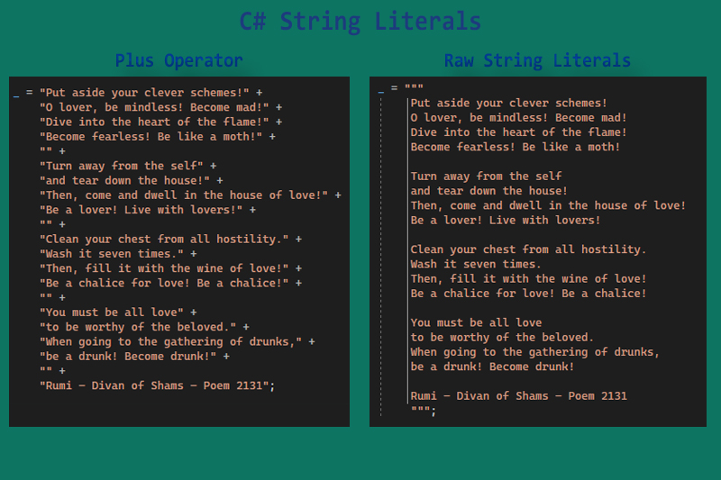

# String Concatenation Performance

Strings and string concatenation is one of the most used concepts in software development 
([C# Guide](https://learn.microsoft.com/en-us/dotnet/csharp/how-to/concatenate-multiple-strings)).

## String literals
   Concatenation of literals is performed at compile-time, not run-time.
   So, when we use plus operator, there's no run-time performance cost regardless of the number of strings involved.
   
   [Benchmark source code](Benchmarks/StringLiteralsBenchmark.cs)

|                  Method |  Runtime |        Mean | Ratio |   Gen0 | Allocated | Alloc Ratio |
|-----------------------: |--------- |------------:|------:|-------:|----------:|------------:|
|              + operator | .NET 6.0 |   0.0103 ns | 0.000 |      - |         - |        0.00 |
| One-line (Hard to read) | .NET 6.0 |   0.0034 ns | 0.000 |      - |         - |        0.00 |
|     Raw string literals | .NET 6.0 |   0.0034 ns | 0.000 |      - |         - |        0.00 |
|             string.Join | .NET 6.0 | 368.1577 ns | 0.751 | 0.3190 |    1336 B |        0.91 |
|           string.Concat | .NET 6.0 | 490.6454 ns | 1.000 | 0.3500 |    1464 B |        1.00 |
|                         |          |             |       |        |           |             |
|              + operator | .NET 7.0 |   0.0440 ns | 0.000 |      - |         - |        0.00 |
| One-line (Hard to read) | .NET 7.0 |   0.0052 ns | 0.000 |      - |         - |        0.00 |
|     Raw string literals | .NET 7.0 |   0.0124 ns | 0.000 |      - |         - |        0.00 |
|             string.Join | .NET 7.0 | 382.4700 ns | 0.855 | 0.3190 |    1336 B |        0.91 |
|           string.Concat | .NET 7.0 | 447.6072 ns | 1.000 | 0.3500 |    1464 B |        1.00 |

`string.Join` and `string.Concat` aren't sutable for string literals concatenation, and must be avoided. 

The best one is [Raw string literals](https://learn.microsoft.com/en-us/dotnet/csharp/whats-new/csharp-11#raw-string-literals) that intrduced in C# 11. It's more readable than `+` operator and also, easier to edit.

## String formatting
- Small length
 
- Medium length

- Long length

## Culture in string formatting 

## `string.Join` vs `string.Concat`

